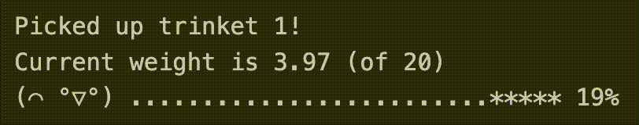

# Trinket Collector

Collect voltages and drop bursts



_for monome crow_

v1.0.0

```
-- You are a crow.
-- You love to fly and look for trinkets.
-- You pick up trinkets and carry them with you.
-- Your beak is small, your strength is configurable.
-- You will drop all trinkets if you carry too much weight.

-- This script samples incoming CV values on each trigger and
-- stores them in a list. When the combined value of the stored
-- trinkets exceeds a defined threshold, all stored values are
-- released sequentially.
-- The threshold, playback order, and release timing can be
-- shaped with the configurable parameters.

-- Input 1: (CV) Trinkets, weighted in volts
-- Input 2: (Trig) Pick up the current trinket
-- Output 1: (CV) The weight of the dropped trinket, in volts
-- Output 2: (Trig) The thud when the trinket hits the ground

-- Output 3 and 4 are currently just passing through input 1 and 2

-- made with love by
-- ███████▓▓▓▓▓▓▒▒▒▒
-- ███▓▓▓▓▓▓▒▒▒▒▒▒░░
-- ▓▓▓▓▓▒▒▒▒▒▒▒░░░░░
-- s 0 1 s y s t e m
-- cat.no: s02system
```

Hear it in action over [on Bandcamp](https://s01system.bandcamp.com/track/trinket-collector).

Quickstart:

- Go to [web druid](https://dessertplanet.github.io/web-druid/)
- Plug in your crow and hit 'connect' in the bottom-left corner
- Toggle the editor on in the top-right corner
- Paste [the script](https://raw.githubusercontent.com/s01system/trinket-collector/refs/heads/main/trinket_collector.lua) into the editor
- Hit "run" or "upload"
- Feed voltages into crow input one, and triggers into crow input two
- Pick up after your crow
